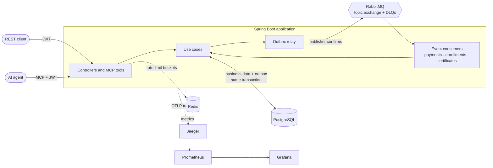
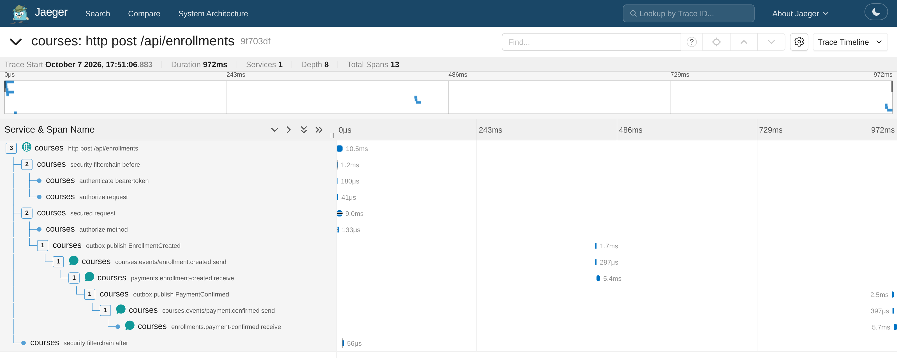
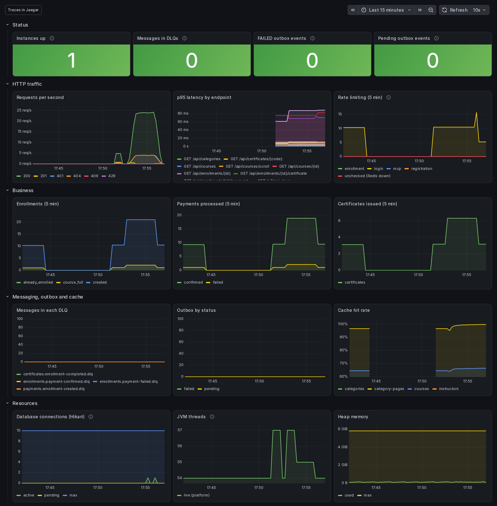

# Courses — event-driven online course platform

[](https://github.com/dreyes17/courses-platform/actions/workflows/ci.yml)


[](LICENSE)

A production-minded backend for an online course platform: a course catalog, enrollments with limited capacity,
payments confirmed asynchronously, and certificates issued from events, with everything flowing through RabbitMQ
via a transactional outbox. Its use cases are exposed both as a REST API and as an MCP server for AI agents, and
it ships with full observability (metrics, alerts, correlated logs and end-to-end distributed traces).

**Stack:** Java 21 (virtual threads) · Spring Boot 4.1 · PostgreSQL · Flyway · Spring AMQP / RabbitMQ ·
Spring Security (JWT) · Caffeine · MapStruct · Bucket4j + Redis · Spring AI (MCP server) · Testcontainers ·
OpenTelemetry · Prometheus · Jaeger · Grafana · GitHub Actions

## Highlights

- **No lost or phantom events.** A [transactional outbox](docs/messaging.md#transactional-outbox) with
  `FOR UPDATE SKIP LOCKED` and publisher confirms gives at-least-once delivery; consumers
  [deduplicate](docs/messaging.md#consumer-side-deduplication-processed_events) inside the same transaction as
  their side effect. Retries with backoff and per-queue DLQs keep poison messages out of the way.
- **Overbooking is impossible.** Seats are reserved with a single [conditional `UPDATE`](docs/concurrency.md#seat-reservation)
  and backed by a `CHECK` constraint; a test fires 20 concurrent students at 3 seats. `Idempotency-Key` makes
  retried enrollments safe.
- **One trace per enrollment.** The W3C `traceparent` and a correlation id are stored with each outbox row, so a
  single [trace](docs/observability.md#distributed-tracing-opentelemetry--jaeger) spans the HTTP request, the
  relay, RabbitMQ and every consumer.
- **Operable from day one.** Business metrics, five Prometheus alerts (DLQ, stalled outbox, rate limiting down…),
  a provisioned Grafana dashboard, structured JSON logs and Actuator isolated on an
  [internal management port](docs/security.md#actuator-and-the-management-port).
- **Secure by default.** Self-issued JWTs, role and ownership rules on every endpoint, timing-safe login,
  RFC 9457 errors that never leak internals, and [Redis-backed rate limiting](docs/security.md#rate-limiting)
  shared across instances (deliberately fail-open, and alerted on).
- **AI-ready.** The same use cases are exposed as [32 MCP tools](docs/mcp.md), with the same token, permissions
  and rate limits as the REST API.
- **Tested for real.** 149 tests against real PostgreSQL, RabbitMQ and Redis (Testcontainers) in under a
  minute, including [mutation-style checks](docs/testing.md#proving-the-tests-catch-regressions) that each key
  safeguard is actually covered.

## Architecture



The code is organised **by bounded context** (`catalog`, `enrollment`, `payment`, `certificate`, `identity`),
each split into `domain`, `application`, `repository`, `web`, `messaging` and `mcp` layers. Controllers, listeners
and MCP tools are thin adapters over the same use cases. The [architecture notes](docs/architecture.md) explain
why it's layered rather than hexagonal, and where real ports and adapters do exist.

One enrollment in Jaeger, as a single trace: the HTTP request, then (after the relay's next poll) the outbox
publish, RabbitMQ, the payment consumer, a second outbox hop and the enrollment activation:



The Grafana dashboard after running [`scripts/demo-traffic.sh`](scripts/demo-traffic.sh):



The enrollment lifecycle, end to end:

```
POST /api/enrollments ─► seat reserved + Enrollment PENDING_PAYMENT + outbox EnrollmentCreated   (one transaction)
                         └─► PaymentProcessor charges the gateway ─► PaymentConfirmed | PaymentFailed
                               └─► Enrollment ACTIVE | CANCELLED (seat released)
progress = 100 ─────────► Enrollment COMPLETED ─► EnrollmentCompleted ─► Certificate issued
```

## Quick start

Only Docker is required:

```bash
cp .env.example .env          # local secrets; .env is git-ignored
docker compose up --build     # PostgreSQL, RabbitMQ, Redis, the app, Prometheus, Jaeger and Grafana
```

| | URL |
|---|---|
| API docs (Swagger UI) | <http://localhost:8080/swagger-ui.html> |
| MCP server | `http://localhost:8080/mcp` |
| RabbitMQ UI | <http://localhost:15672> |
| Grafana | <http://localhost:3000> |
| Jaeger | <http://localhost:16686> |
| Prometheus | <http://localhost:9090> |

Get an ADMIN token and call the API:

```bash
set -a; . ./.env; set +a
TOKEN=$(curl -s localhost:8080/api/auth/token -H 'Content-Type: application/json' \
  -d "{\"email\":\"$ADMIN_EMAIL\",\"password\":\"$ADMIN_PASSWORD\"}" | jq -r .accessToken)
curl localhost:8080/api/courses -H "Authorization: Bearer $TOKEN"
```

Or let [`scripts/demo-traffic.sh`](scripts/demo-traffic.sh) exercise the whole platform in a few seconds (catalog,
enrollments, approved and declined payments, a full course, certificates, rate limiting), then open Grafana and
Jaeger to see the result.

Run the tests with `./mvnw test` (needs Docker for Testcontainers). A ready-to-use [devcontainer](.devcontainer/)
is included as well. See [Getting started](docs/getting-started.md) for both, and for running inside the
devcontainer.

## Documentation

| Topic | |
|---|---|
| [Getting started](docs/getting-started.md) | Docker Compose, devcontainer, environment variables |
| [Architecture](docs/architecture.md) | Package layout, separation of concerns, layered vs. hexagonal, MapStruct |
| [REST API](docs/api.md) | Resources, conventions, cursor pagination, error model |
| [Security](docs/security.md) | JWT, roles and ownership, rate limiting, Actuator isolation |
| [Messaging](docs/messaging.md) | Enrollment flow, RabbitMQ topology, transactional outbox, consumer deduplication |
| [Concurrency](docs/concurrency.md) | Atomic seat reservation, `Idempotency-Key` |
| [Observability](docs/observability.md) | Metrics, alerts, correlated logs, distributed tracing, Grafana |
| [Performance](docs/performance.md) | Virtual threads (measured for pinning), catalog cache |
| [MCP integration](docs/mcp.md) | The 32 tools, design and how to try them |
| [Testing and CI](docs/testing.md) | Test pyramid, regression proofs, GitHub Actions |

## Trade-offs and future work

Known limitations, each a conscious trade-off for the current scope:

- **Payment confirmed for an already-cancelled enrollment.** If the student cancels while the charge is in
  flight, the payment may still be confirmed. `PaymentProcessor` narrows the window by not charging enrollments
  that are no longer `PENDING_PAYMENT`; if it still happens, a "manual refund" warning is logged. A refund flow is
  out of scope.
- **Gateway call inside the transaction.** `PaymentProcessor` calls the gateway with the database transaction
  open. Harmless with the simulated gateway; with a real one, the charge should be moved out of the transaction.
  The payment's idempotency key (`enrollment-<id>`) already prevents double charges on retry.
- **Rate limiting without Redis.** If Redis is down, requests pass unchecked (deliberately *fail-open*) until it
  returns. The `RateLimitingUnavailable` alert flags it.
- **Per-instance cache.** With several instances, the displayed seat count may lag by up to 1 minute on the
  instances that didn't make the change. Swapping in a Redis `CacheManager` would fix it without code changes.
- **No rate limit on certificate verification.** `GET /api/certificates/{code}` is public with no budget of its
  own. Guessing codes isn't feasible (64 random bits), but a client could use it to generate load; a per-IP rule
  in `RateLimitFilter`, like the login one, would cover it.
- **`FAILED` outbox rows** need manual intervention. The `courses_outbox_events{status="failed"}` metric and the
  `OutboxEventsFailed` alert flag them, but there's no endpoint or job to republish them yet.

## License

[MIT](LICENSE) © Daniel Reyes Parrilla
