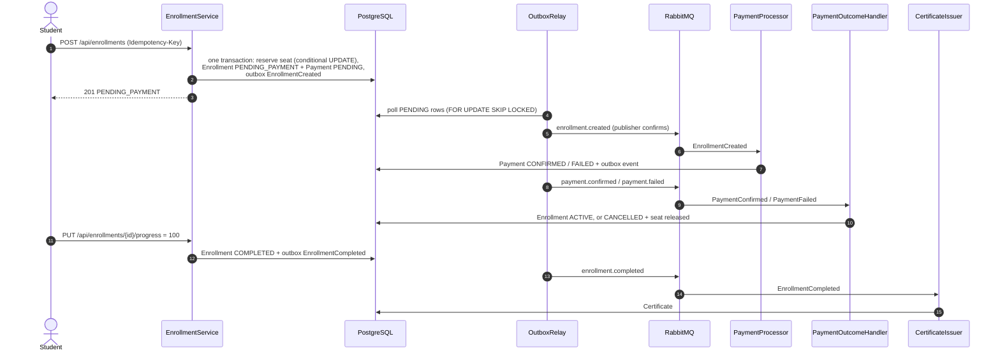

# Messaging and the enrollment flow

- [Enrollment flow](#enrollment-flow)
- [Payment confirmation: why there's no "pay" endpoint](#payment-confirmation-why-theres-no-pay-endpoint)
- [RabbitMQ topology](#rabbitmq-topology)
- [Transactional outbox](#transactional-outbox)
- [Consumer-side deduplication (`processed_events`)](#consumer-side-deduplication-processed_events)
- [What `processed_events` doesn't solve](#what-processed_events-doesnt-solve)

## Enrollment flow



Every arrow towards RabbitMQ leaves from the outbox, never from a direct `send` inside the request.

## Payment confirmation: why there's no "pay" endpoint

The payment is simulated, and its confirmation is processed asynchronously over RabbitMQ: a consumer charges the
payment and publishes `PaymentConfirmed` or `PaymentFailed`. From the student's point of view:

- **Paying is enrolling.** `POST /api/enrollments` creates the `Payment` as `PENDING` together with the
  enrollment, and `EnrollmentCreated` acts as the charge order.
- **Confirming is the consumer's job.** `PaymentProcessor` charges `SimulatedPaymentGateway` and publishes the
  result. Nothing in the HTTP request decides whether the payment succeeds.
- **Why not an endpoint where the student confirms their own payment:** the outcome of a charge is decided by the
  gateway, never by the payer. Such an endpoint would allow activating an enrollment without charging for it.
  With a real gateway, its confirmation would arrive via a *webhook*, which would be one more input adapter with
  the same effect as today's consumer: publishing `PaymentConfirmed`.
- **How to trigger a decline.** The simulated gateway approves any amount up to
  `app.payments.simulation.decline-above` (10,000 by default) and declines anything higher. A more expensive
  course walks the `PaymentFailed` branch: the enrollment is cancelled and the seat released.
- **What the client sees.** `GET /api/enrollments/{id}` shows the enrollment's status, and
  `GET /api/enrollments/{id}/payment` the payment's. If the charge failed, the payment carries `failureReason`,
  stored in `payments.failure_reason` (`V6__payment_failure_reason.sql`; a `CHECK` constraint requires it exactly
  when the status is `FAILED`). A `CANCELLED` enrollment is never left unexplained. Once completed,
  `GET /api/enrollments/{id}/certificate` returns the certificate as soon as `CertificateIssuer` issues it (404
  until then).

## RabbitMQ topology

Declared in code in `RabbitTopology`:

```
exchange courses.events (topic, durable)
  enrollment.created   ──► payments.enrollment-created        ──(DLX)──► payments.enrollment-created.dlq
  payment.confirmed    ──► enrollments.payment-confirmed      ──(DLX)──► enrollments.payment-confirmed.dlq
  payment.failed       ──► enrollments.payment-failed         ──(DLX)──► enrollments.payment-failed.dlq
  enrollment.completed ──► certificates.enrollment-completed  ──(DLX)──► certificates.enrollment-completed.dlq

exchange courses.events.dlx (direct, durable) — routing key = <queue>.dlq
```

- **One queue per consumer:** an event can have several independent subscribers. Adding one means adding a queue
  and a binding, without touching the publisher.
- **Retries:** `spring.rabbitmq.listener.simple.retry` makes 3 retries with exponential backoff (1s, 2s, 4s, 10s
  max). After that, `default-requeue-rejected: false` rejects the message without requeueing and the broker
  routes it to its DLQ. A poison message never blocks the queue.
- **Malformed messages:** if the `messageId` is missing or the JSON is invalid, `InboundEventReader` throws
  `AmqpRejectAndDontRequeueException`, because that message will never work however many times it's retried.
- **Per-message metadata:** `messageId` = event id (deduplication key), `type` = event name, `timestamp`,
  `correlationId` = aggregate id, and the headers `x-event-version` and `x-aggregate-type`. The body is JSON
  generated from the event's `record`, never from the JPA entity.

## Transactional outbox

### The problem

When the enrollment service commits a domain change in Postgres (e.g. creates an `Enrollment` in
`PENDING_PAYMENT`), it also has to publish an event (`EnrollmentCreated`) to RabbitMQ. If that publish happened
directly inside the same HTTP request, the database commit and the broker publish would be two independent,
non-atomic operations:

- The commit succeeds but the publish fails (broker down, network timeout) → the event is lost forever; nobody
  will ever activate the enrollment or charge for it.
- The publish succeeds but the database transaction rolls back afterwards → an event was published about a state
  that never existed.

### The solution

Instead of publishing directly, the same transaction that persists the domain change also inserts a row into
`outbox_events`, over the same JDBC connection. Since the `INSERT` into `enrollments` and the `INSERT` into
`outbox_events` happen in the same transaction, either both commit or neither does: there's no window in which
one exists without the other.

The columns of `outbox_events` and what each one is for:

- **`id` (UUID)** — the event's identifier. It's reused as the `messageId` when publishing to RabbitMQ, and it's
  half of the deduplication key in `processed_events`.
- **`aggregate_type` / `aggregate_id`** — which domain entity produced the event (e.g. `"Enrollment"` + the
  enrollment's UUID). Useful for traceability and debugging, and for a future per-aggregate event feed.
- **`event_type`** — the domain event's name (`EnrollmentCreated`, `PaymentConfirmed`, `PaymentFailed`,
  `EnrollmentCompleted`), decoupled from the Java class name so the event contract can be versioned
  independently of internal code.
- **`payload` (JSONB)** — the already-serialised event body, built from the event contract's own DTO, never by
  serialising the JPA entity; a refactor of the internal model doesn't break the published contract.
- **`status` (`PENDING`/`PUBLISHED`/`FAILED`)** — `OutboxRelay` runs every 500 ms and works like this:
  - it reads up to 100 `PENDING` rows ordered by `created_at` (hence the composite index
    `idx_outbox_events_status_created`) with `FOR UPDATE SKIP LOCKED`, so several app instances can run the
    relay without publishing the same rows at the same time;
  - it publishes each one with *publisher confirms* and only marks it `PUBLISHED` once the broker confirms;
  - if the broker doesn't confirm or doesn't respond, the row stays `PENDING`, the batch stops and is retried on
    the next cycle. A restart halfway through doesn't lose the event;
  - if the message has no queue to receive it (*returned*, since it's published as `mandatory`), the row becomes
    `FAILED`. That's a configuration error a person needs to look at; retrying in a loop wouldn't fix it.
- **`created_at` / `published_at`** — order the publishing queue and measure the lag between "something
  happened" and "it went out on the bus", a useful observability signal.

This strategy gives **at-least-once delivery**: an event may be published more than once (for example if the
relay publishes it but crashes before marking it `PUBLISHED`), but it's never lost.

## Consumer-side deduplication (`processed_events`)

Since the guarantee is "at least once", a RabbitMQ listener can receive the same message twice (broker
redelivery, consumer restart before the ack, etc.). Unprotected, that would duplicate effects — activating an
enrollment twice, issuing two certificates.

`processed_events` is the consumer-side deduplication table. Before applying an event's effect, the listener
checks, **inside the same transaction** that will apply that effect, whether a row already exists for
`(event_id, consumer_name)`:

- if it exists, the message is a duplicate: it's discarded without reapplying the effect (and acked);
- if not, the business effect is applied and the row inserted, in the same transaction.

The check and the insert are a single statement, `INSERT ... ON CONFLICT DO NOTHING`
(`IdempotentConsumer.isFirstDelivery`), not a `SELECT` followed by an `INSERT`. So if two deliveries of the same
message arrive at once, the second waits on the first's uncommitted row. When the first commits, the second gets
"0 rows" and is discarded; if the first rolls back, the second processes the event.

Consumers also check state before acting, as a second line of defence. For example, `CertificateIssuer` doesn't
issue if a certificate already exists for that enrollment, and the `UNIQUE` constraint on
`certificates.enrollment_id` guarantees it as a last resort. That covers even the same event republished under a
different id. `ConsumerIdempotencyTest` sends duplicate deliveries and checks there's only one activation and
one certificate.

The key is composite (`event_id`, `consumer_name`) and not just `event_id` because the same event can have more
than one interested consumer (for example, `EnrollmentCompleted` is consumed today by the certificate issuer, and
tomorrow a notification service might consume it too). Each consumer needs its own record of "I already
processed this", independent of the others — with `event_id` as the only key, the first consumer to process the
event would silently block the rest.

Inserting the `processed_events` row in the same transaction as the business effect is what makes deduplication
reliable: if the effect fails and the transaction rolls back, the row isn't inserted either, and the message can
be reprocessed correctly on the next attempt.

## What `processed_events` doesn't solve

Retries with backoff and the dead-letter queue cover a different problem: a message that can **never** be
processed successfully (corrupt payload, reference to a resource that doesn't exist). After exhausting the
retries, that message moves to the DLQ instead of blocking the queue. `processed_events` solves "I already
processed this message, don't process it again"; the DLQ solves "this message can't be processed, get it out of
the queue". They're independent, complementary mechanisms.
